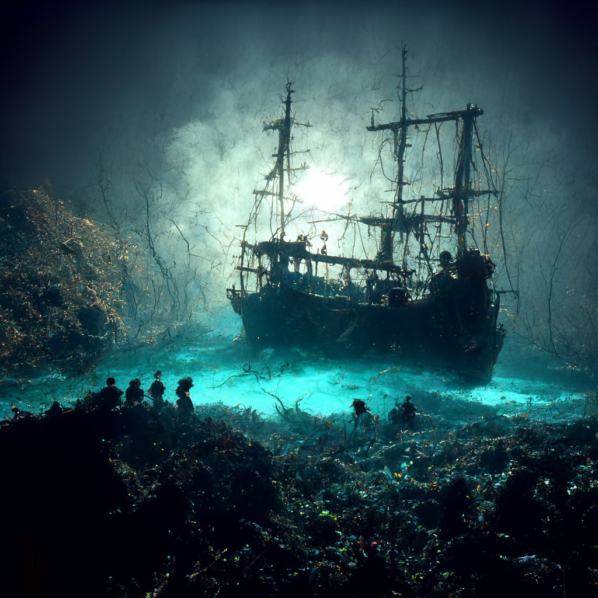

<h1> DevOps Engineer | Fullstack developer | Webdesigner </h1>

- 📫 How to reach me : sterbik.pierrealexandre@gmail.com
- :trophy: You can find a step by step complete CI/CD deployment project using a plethora of devops technologies, including an AWS infrastructure, by following this link : [Link to project](https://docs.google.com/document/d/1pa4Xx0-eNUB6V12sOGlKhN1sh6cydZEe/edit?usp=drive_link&ouid=117616023064011937677&rtpof=true&sd=true)
- :triangular_ruler: you can check projects in production below :

| [Webdesign](https://www.zebrart.fr/) | [Restaurant](https://www.le-parnasse-versailles.fr/) | [Real Estate Agency](https://cabinetlaclef.com/) 
:---------------:|:---------------:|:---------------:|

- :loudspeaker: currently working on a Flutter project to create a dynamic map and tour of the Gardens of Versailles ! If anyone is interested to participate in the project feel free to send me a message ! Repository [here](https://github.com/Manianise/versailles-gardens-fun-visit).

## Technical stack

### Devops

| Jenkins | Sonarqube | Kubernetes | Terraform | Ansible | Docker | Prometheus | Grafana |
:---------------:|:---------------:|:---------------:|:---------------:|:---------------:|:---------------:|:---------------:|:---------------:|

> Repository for ansible, prometheus and grafana : [Link to repo](https://github.com/Manianise/ansible-prometheus-grafana) \
> Repository for docker, jenkins and sonarqube : [Link to repo](https://github.com/Manianise/docker-jenkins-env) \
> Repository for Terraform and AWS : [Link to repo](https://github.com/Manianise/terraform-ec2-aws) \
> Example of a functionning Jenkins pipeline : [Link to app](https://github.com/Manianise/api_nodejs)

### Developer

| PHP | TypeScript | Javascript | NodeJS | ReactJS | NestJS | Ruby |
:---------------:|:---------------:|:---------------:|:---------------:|:---------------:|:---------------:|:---------------:|

> 2025 - 🔥 Microservice for Stripe API calls to automate creation of Checkout Session : [Check it out !](https://github.com/Manianise/stripe-dispute-microservice)
> 2024 -Repository for ReactJS quick app using tailwind : [Link to repo](https://github.com/Manianise/sterbik-react) \
> 2024 - Repository for the creation of podcast API using NestJS : [Link to repo](https://github.com/Manianise/podcast-api) \
> 2024 - Repository for a chatbot using websockets and Javascript : [link to repo](https://github.com/Manianise/Chatssistant-SocketIO)
> 2023 - Repository for ReactJS quick app : [Link to repo](https://github.com/Manianise/spiritsPresentation) \

### Design

| Adobe Suite | Blender | CSS | Tailwind | ReactJS | Bootstrap |
:---------------:|:---------------:|:---------------:|:---------------:|:---------------:|:---------------:|

#### Design - CSS - SVG

#### Design - AfterFX - Blender

 

#### Design - Photoshop

#### Design - AI

## Collaborations and Production :

