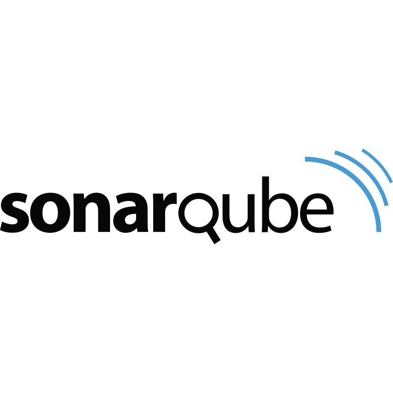

<h1> Administrateur Système et réseaux DevOps | Webdeveloper | Webdesign </h1>

- 🔭 I’m currently working on building a Jenkins server with Tomcat
- 🌱 I’m currently learning advanced Ansible et Kubernetes
- 📫 How to reach me: sterbik.pierrealexandre@gmail.com

## Technical stack

#### Devops

| Jenkins | Sonarqube | Kubernetes | Terraform | Ansible | Docker
:---------------:|:---------------:|:---------------:|:---------------:|:---------------:|:---------------:|

#### Developer

| PHP | Javascript | CSS | MySQL | PostgresSQL | 
:---------------:|:---------------:|:---------------:|:---------------:|:---------------:|

#### Design

| Photoshop | InDesign | AfterFX | PremierePro | Blender | Figma
:---------------:|:---------------:|:---------------:|:---------------:|:---------------:|:---------------:|

## Les réalisations "so far"

### Devops - Terraform

- [Projet déploiement CI/CD avec Terraform](https://github.com/Manianise/TP/tree/ci-cd)

### Développement - Javascript

- [Projet frontend en utilisant ReactJS et ViteJS](https://github.com/Manianise/spiritsPresentation)

### Développement - CSS

### Design - Vidéo - AfterFX - Blender

 

### Design - Photoshop

### Design - AI

## Les collaborations et freelance :

- [Site de webdesign](https://www.zebrart.fr/)
- [Site restaurant](https://www.le-parnasse-versailles.fr/)
- [Site d'agence immobilière](https://cabinetlaclef.com/)

